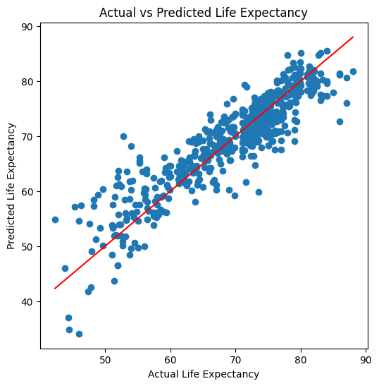

# Life Expectancy Prediction

Regression model predicting country life expectancy from health, economic, and social indicators using Linear Regression, Decision Tree, and Random Forest.

## 📌 Overview

Life expectancy is one of the clearest signals of a nation's overall health and development, shaped by a mix of factors including healthcare quality, economic strength, education, and lifestyle. This project uses the **WHO Life Expectancy dataset** to explore these relationships and build a regression model that predicts a country's average life expectancy from its measurable indicators.

Built as part of a 12-week Machine Learning internship.

## 🎯 Objective

- Predict a country's life expectancy using health, economic, and social indicators
- Identify which factors most strongly influence life expectancy
- Compare multiple regression models to find the most accurate approach

## 📊 Dataset

- **Source:** [WHO Life Expectancy Dataset](https://www.kaggle.com/datasets/kumarajarshi/life-expectancy-who) (Kaggle)
- **Size:** 2,938 records, 22 columns
- **Features include:** GDP, Schooling, Adult Mortality, BMI, Alcohol consumption, Hepatitis B, Measles, Polio, Diphtheria, HIV/AIDS, Population, Income composition of resources, and more

## ⚙️ Methodology

1. **Data Cleaning** — Dropped rows with missing target values (`Life expectancy`), removed the `Country` column, and filled remaining missing feature values with the column mean
2. **Feature Encoding** — Converted the categorical `Status` column (Developed/Developing) into numeric form
3. **Scaling & Split** — Split data 80/20 into train/test sets, then standardized features (scaler fit on training data only, to avoid data leakage)
4. **Model Training** — Trained three regression models: Linear Regression, Decision Tree, and Random Forest
5. **Evaluation** — Compared models using MAE, MSE, RMSE, and R² score on the held-out test set

## 📈 Results

| Model | MAE | RMSE | R² Score |
|---|---|---|---|
| Linear Regression | 2.92 | 3.94 | 0.821 |
| Decision Tree | 1.51 | 2.60 | 0.922 |
| **Random Forest** | **1.06** | **1.66** | **0.969** |

**Random Forest** was the best-performing model, explaining ~97% of the variance in life expectancy.



## 🔑 Key Takeaways

- Ensemble/tree-based models significantly outperformed plain Linear Regression, indicating non-linear relationships in the data
- Health and socio-economic indicators such as schooling, adult mortality, and GDP carry strong predictive power
- The trained model successfully predicts outcomes on new, unseen input

## 🛠️ Tech Stack

- Python
- Pandas, NumPy
- Scikit-learn
- Matplotlib
- Jupyter / Google Colab

## 🚀 Running This Project

```bash
pip install -r requirements.txt
jupyter notebook Life_Expectancy_Prediction.ipynb
```

## 📁 Files

- `Life_Expectancy_Prediction.ipynb` — Full notebook (data cleaning, EDA, modeling, evaluation)
- `scatter_plot.png` — Actual vs. Predicted life expectancy visualization
- `requirements.txt` — Python dependencies
